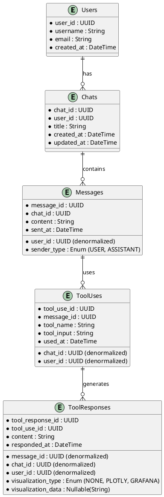

# Chat History Data Model

This document describes the data model for storing user chat histories in ClickHouse, including the preservation of tool uses and responses from MCP Clickhouse, Grafana, and Plotly visualizations.

## Entities and Relationships



## Entity Descriptions

### Users
Stores information about the users of the system.
- `user_id`: Unique identifier for each user
- `username`: The username of the user
- `email`: The email address of the user
- `created_at`: When the user was created

### Chats
Stores information about individual chats/conversations.
- `chat_id`: Unique identifier for each chat
- `user_id`: The ID of the user who the chat belongs to
- `title`: A title for the chat
- `created_at`: When the chat was created
- `updated_at`: When the chat was last updated

### Messages
Stores individual messages sent by users or the assistant in a chat.
- `message_id`: Unique identifier for each message
- `chat_id`: The ID of the chat the message belongs to
- `user_id`: The ID of the user who the chat belongs to (denormalized)
- `sender_type`: Whether the message was sent by the user or the assistant
- `content`: The content of the message
- `sent_at`: When the message was sent

### ToolUses
Stores records of tools used by the assistant in the context of a message.
- `tool_use_id`: Unique identifier for each tool use
- `message_id`: The ID of the message that used the tool
- `chat_id`: The ID of the chat the message belongs to (denormalized)
- `user_id`: The ID of the user who the chat belongs to (denormalized)
- `tool_name`: The name of the tool used (e.g., "mcp_clickhouse")
- `tool_input`: The input provided to the tool (e.g., SQL query)
- `used_at`: When the tool was used

### ToolResponses
Stores responses from tools, including visualizations.
- `tool_response_id`: Unique identifier for each tool response
- `tool_use_id`: The ID of the tool use that generated the response
- `message_id`: The ID of the message that used the tool (denormalized)
- `chat_id`: The ID of the chat the message belongs to (denormalized)
- `user_id`: The ID of the user who the chat belongs to (denormalized)
- `content`: The content of the tool response
- `visualization_type`: The type of visualization (NONE, PLOTLY, GRAFANA)
- `visualization_data`: The data for the visualization (NULL for NONE or GRAFANA, which just returns a link)
- `responded_at`: When the tool responded

## ClickHouse SQL Schema

```sql
CREATE TABLE Users (
    user_id UUID,
    username String,
    email String,
    created_at DateTime,
    PRIMARY KEY (user_id)
) ENGINE = MergeTree()
ORDER BY (user_id);

CREATE TABLE Chats (
    chat_id UUID,
    user_id UUID,
    title String,
    created_at DateTime,
    updated_at DateTime,
    PRIMARY KEY (chat_id)
) ENGINE = MergeTree()
ORDER BY (user_id, chat_id, created_at);

CREATE TABLE Messages (
    message_id UUID,
    chat_id UUID,
    user_id UUID,  -- Denormalized for efficient querying
    sender_type Enum('USER' = 1, 'ASSISTANT' = 2),
    content String,
    sent_at DateTime,
    PRIMARY KEY (message_id)
) ENGINE = MergeTree()
ORDER BY (user_id, chat_id, sent_at);

CREATE TABLE ToolUses (
    tool_use_id UUID,
    message_id UUID,
    chat_id UUID,    -- Denormalized for efficient querying
    user_id UUID,    -- Denormalized for efficient querying
    tool_name String,
    tool_input String,
    used_at DateTime,
    PRIMARY KEY (tool_use_id)
) ENGINE = MergeTree()
ORDER BY (user_id, chat_id, message_id, used_at);

CREATE TABLE ToolResponses (
    tool_response_id UUID,
    tool_use_id UUID,
    message_id UUID,  -- Denormalized for efficient querying
    chat_id UUID,     -- Denormalized for efficient querying
    user_id UUID,     -- Denormalized for efficient querying
    content String,
    visualization_type Enum('NONE' = 0, 'PLOTLY' = 1, 'GRAFANA' = 2),
    visualization_data Nullable(String),
    responded_at DateTime,
    PRIMARY KEY (tool_response_id)
) ENGINE = MergeTree()
ORDER BY (user_id, chat_id, message_id, tool_use_id, responded_at);
```

## Common Query Patterns

1. Retrieve all chats for a user:
```sql
SELECT * FROM Chats WHERE user_id = 'some-user-id' ORDER BY updated_at DESC;
```

2. Retrieve all messages in a chat:
```sql
SELECT * FROM Messages WHERE chat_id = 'some-chat-id' ORDER BY sent_at;
```

3. Retrieve all tool uses and responses for a message:
```sql
-- Get all tool uses for a message
SELECT * FROM ToolUses WHERE message_id = 'some-message-id' ORDER BY used_at;

-- Get all tool responses for those tool uses
SELECT * FROM ToolResponses WHERE message_id = 'some-message-id' ORDER BY responded_at;
```

4. Retrieve the complete chat history with tool usage for context:
```sql
-- Get all messages with their tool uses and responses
SELECT 
    m.*,
    groupArray(tu.tool_use_id) AS tool_use_ids,
    groupArray(tu.tool_name) AS tool_names,
    groupArray(tu.tool_input) AS tool_inputs,
    groupArray(tr.visualization_type) AS visualization_types,
    groupArray(tr.visualization_data) AS visualization_data
FROM Messages m
LEFT JOIN ToolUses tu ON m.message_id = tu.message_id
LEFT JOIN ToolResponses tr ON tu.tool_use_id = tr.tool_use_id
WHERE m.chat_id = 'some-chat-id'
GROUP BY m.message_id, m.chat_id, m.user_id, m.sender_type, m.content, m.sent_at
ORDER BY m.sent_at;
```
